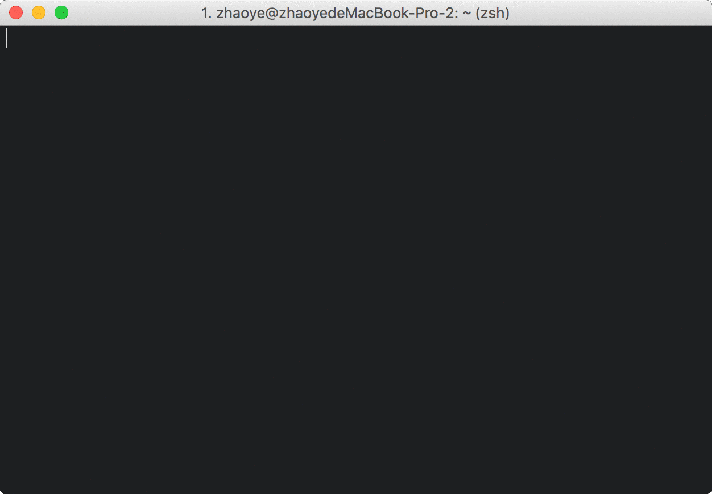

# MellPlayer


A tiny terminal player of NetEase-Music based on Python3.



# OverView
* [English Tutorial](#English Tutorial)
	- [Support](#Support)
	- [Installation](#Installation)
	- [Additional Mac OSX Installation notes](#Additional Mac OSX Installation notes)
	- [Upgrading](#Upgrading)
	- [Usage](#Usage)
	- [Keys](#Keys)
* [中文说明](#Chinese Tutorial)
	- [前言](#Preface_cn)
	- [开发理念](#Develop idea_cn)
	- [关于项目](#About Repo_cn)
	- [支持](#Support_cn)
	- [安装](#Installation_cn)
	- [Mac OSX 安装依赖](#Additional Mac OSX Installation notes_cn)
	- [更新](#Upgrading_cn)
	- [使用](#Usage_cn)
	- [快捷键](#Keys_cn)

## <a name="English Tutorial"></a>English Tutorial

### <a name="Support"></a>Support
OSX & Linux (Linux is not tested)

### <a name="Installation"></a>Installation
Using [pip](https://pip.pypa.io/en/stable/)
```bash
[sudo] pip3 install MellPlayer
```

### <a name="Additional Mac OSX Installation notes"></a>Additional Mac OSX Installation notes
Install mpv with [Homebrew](https://brew.sh/)
```bash
brew install mpv
```

### <a name="Upgrading"></a>Upgrading
Upgrade pip installation:
```bash
[sudo] pip3 install MellPlayer --upgrade
```

### <a name="Usage"></a>Usage
MellPlayer is run on the command line using the command:
```bash
mellplayer
```

### <a name="Keys"></a>Keys
```

 操作
 [j]     [Next Line]         --->  下
 [k]     [Prev Line]         --->  上
 [q]     [Quit]              --->  退出

 音乐
 [space] [Start/Pause]       --->  播放／暂停
 [n]     [Next Song]         --->  下一曲
 [p]     [Prev Song]         --->  上一曲
 [f]     [Forward Playlist]  --->  下个歌单
 [b]     [Backward Playlist] --->  上个歌单

 音量
 [-]     [Reduce Volume]     --->  减小音量
 [=]     [Increase Volume]   --->  增加音量
 [m]     [Mute]              --->  静音

 歌词
 [l]     [Show/Hide Lyric]   --->  显示／关闭歌词

 帮助
 [h]     [Show/Hide Help]    --->  显示／关闭帮助
     
```


## <a name="Chinese Tutorial"></a>中文说明

### <a name="Preface_cn"></a>前言
我写代码时非常喜欢听音乐，最近在网易云歌单中听到了许多入耳惊艳的歌，觉得非常不错。但是歌单的随机播放以及快速切换是个软肋，于是开发了MellPlayer，可以按照分类随机听歌，实现了歌单间的快速切换，希望大家能够喜欢。

### <a name="Develop idea_cn"></a>开发理念
MellPlayer的初版刚刚发布，还有许许多多需要改进的地方，非常希望能有志同道合的朋友Fork下来，一起打造越来越完美的播放器，下面就说下我的开发理念：

>MellPlayer是一款命令行播放器，主要是为了实现根据心情随机听歌，并且能够快速进行歌单间的切换，简约流畅，我希望在此基础上谨慎添加小而美的功能。并不想引入过多繁琐的功能，添加一大堆的快捷键，将简洁的东西繁琐化是违背我的初衷的。


### <a name="About Repo_cn"></a>关于项目
项目地址：[MellPlayer](https://github.com/Mellcap/MellPlayer)

项目基于python3开发，依赖mpv。还有很多地方需要优化改进，大家发现什么问题可以给我提Issue，当然非常欢迎有兴趣的朋友加入，一起打造我们喜欢的播放器。

既然看到这儿了，就来 [Star](https://github.com/Mellcap/MellPlayer) 一下， 互相 [Follow](https://github.com/Mellcap) 一下吧哈哈！！！

#### <a name="Support_cn"></a>支持
OSX & Linux (Linux未经过测试)

### <a name="Installation_cn"></a>安装
通过 [pip3](https://pip.pypa.io/en/stable/) 安装
```bash
[sudo] pip3 install MellPlayer
```

#### <a name="Additional Mac OSX Installation notes_cn"></a>Mac OSX 安装依赖
通过 [Homebrew](https://brew.sh/) 安装 mpv
```bash
brew install mpv
```

#### <a name="Upgrading_cn"></a>更新
通过 pip3 更新
```bash
[sudo] pip3 install MellPlayer --upgrade
```

### <a name="Usage_cn"></a>使用
在命令行直接输入mellplayer即可享受：
```bash
mellplayer
```

#### <a name="Keys_cn"></a>快捷键
```

 操作
 [j]     [Next Line]         --->  下
 [k]     [Prev Line]         --->  上
 [q]     [Quit]              --->  退出

 音乐
 [space] [Start/Pause]       --->  播放／暂停
 [n]     [Next Song]         --->  下一曲
 [p]     [Prev Song]         --->  上一曲
 [f]     [Forward Playlist]  --->  下个歌单
 [b]     [Backward Playlist] --->  上个歌单

 音量
 [-]     [Reduce Volume]     --->  减小音量
 [=]     [Increase Volume]   --->  增加音量
 [m]     [Mute]              --->  静音

 歌词
 [l]     [Show/Hide Lyric]   --->  显示／关闭歌词

 帮助
 [h]     [Show/Hide Help]    --->  显示／关闭帮助
     
```


